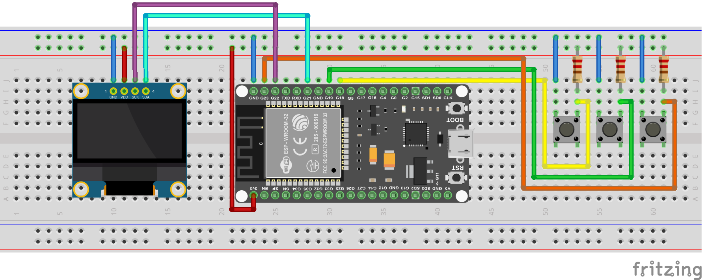

# ArduinoGotchi - A real Tamagotchi emulator for ESP32

## Synopsis

**ArduinoGotchi** is a real [Tamagotchi P1](https://tamagotchi.fandom.com/wiki/Tamagotchi_(1996_Pet)) emulator running in Arduino UNO hardware. The emulation core is based on [TamaLib](https://github.com/jcrona/tamalib) with intensive optimization to make it fit into UNO's hardware that only comes with 32K Flash 2K RAM.

## BUILD

### Firmware

First, install Visual Code and the PlatformIO.
Open the `firmware/Tamagotchi32` folder as `Workspace-Folder`

Open the Platformio by clicking on the Icon on the left sidebar.
Select your desired plattform:

* nanoatmega328
* esp8266
* esp32

And use the `build` task to build for the selected platforms. Next run `Upload` to upload the firmware to the connected board.

### Circuit Diagram

### CASE

The case can be found here [CASE](https://www.thingiverse.com/thing:2374552)

### Example build

For the example build the following parts were used:

* ESP32 Devboard
* 0.96" OLED Display
* 3x buttons
* 3x 10k pull-down resistors
* 1s USB-C lipo charging board
* 1s 3.7v 220mAh LIPO
* StepUp converter

## Game notes

- To activate your pet, you have to configure the clock by pressing the middle button. Otherwise, your pet will not alive.
- A long click on "back" button for 5 seconds, will reset memory back to egg state

### License
ArduinoGotchi is distributed under the GPLv2 license. See the LICENSE file for more information.
